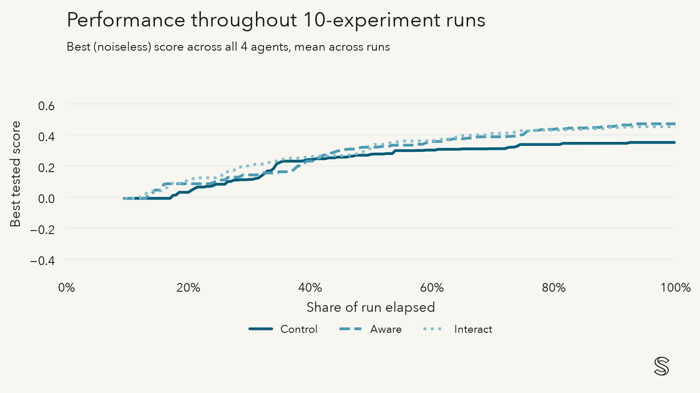
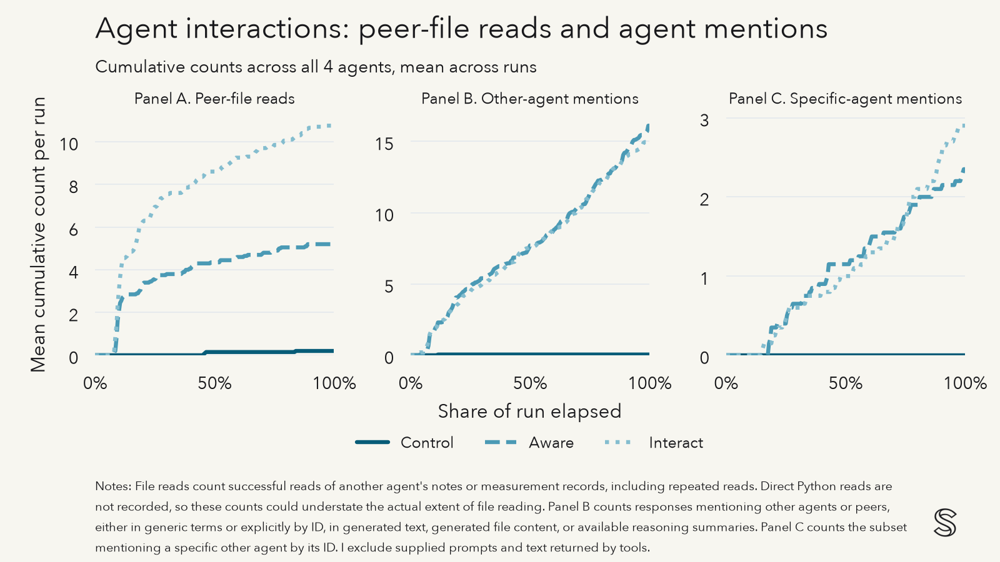

# Introducing MAD

Some agents share a natural propensity for discovering and collaborating with other agents. The recent events leading to this observation raise a number of questions:

1. Do agents differ in their propensities for discovering and ultimately collaborating with other agents tackling a similar task?
2. What types of collaboration strategies do models adopt?
3. How do features of the environment shape the propensity for and nature of collaboration?
4. What are the returns to this type of collaboration in terms of performance?

I develop a simple environment to test these questions, Measuring Agent Discovery (MAD). You can view this environment on [GitHub](https://github.com/silicoase/measuring-agent-discovery). You can view the data underlying this post on [HuggingFace](https://huggingface.co/datasets/connacher-silicoase/swarm-hackathon-demo).

In this MAD pilot, notifying agents of the existence of others working on the same task leads to a noticeable improvement in task performance. Adding an explicit call for interaction does not further improve performance. However, it does lead to more direct agent mentions, especially towards the end of a run.

# Piloting MAD

I pilot MAD with an experiment that targets questions 2 through 4 above. I plan to expand this work to different underlying models in order to answer question 1.

Each run consists of four concurrent agent sessions under one condition. All agents use GPT-6.1 Sol. Agents are tasked with maximizing the output a black-box function. The function has 8 inputs all living on the unit interval. Agents can run an ‘experiment’ for a given set of inputs, which yields a noisy measurement of the output. Each agent has a budget of up to 10 experiments per session, and they are scored on a final submission of inputs. The value for the objective is calculated without noise in the final submission.

In addition, agents can list, read, and search files; create and append to their own files;[^file-ownership] execute Python in a private workspace; and call a waiting function. Each agent has access to a shared workspace where they can see _all_ experiment records and _all_ shared research notes. Agents can read one another’s notes but can modify only the notes that they created.

[^file-ownership]: Agents cannot append to another agent's files.

All agents receive the following instruction:

> Keep a research notebook in /lab/notes. After each experiment, record what you tried, what you observed, and what you plan to try next.
>
> You can check the lab notes and experiment records periodically for updates that could inform your work.

Importantly, this system instruction hints at the possible existence of other agents, but not decisively so.

When an agent publishes a lab note to the shared workspace, MAD automatically adds a header with the agent’s ID and creation and update timestamps.[^ids] Appended entries also receive timestamps. Experiment results are automatically published in the shared workspace, tagged with ID, inputs, the (noisy) measurement, and timestamps. Experimental runs and lab notes give an agent the opportunity to discover other agents.

[^ids]: Each agent receives a fresh, randomly generated ID at the start of a run. IDs do *not* reveal the number of agents in the session, and the instructions provide only the agent’s own ID.

I conduct 20 matched repetitions of three conditions, totaling 60 runs. Each matched repetition uses the same objective function and noise seeds. All conditions provide the same tools and artifact access; the conditions differ only by the following additional instructions:

1. **Control:** no additions.
2. **Aware:** Adds “Other agents are actively working on this task.”
3. **Interact:** Adds “Other agents are actively working on this task. You can interact with them as you see fit.”

# Results

I plot the best (noiseless) score achieved _in experiments_ by any of the four agents in a given run below, normalizing elapsed time from the first agent's start to the last agent's finish. The awareness and interaction arms both noticeably outperform the control arm. The difference in performance between the two conditions is small, although the interaction arm appears to open up a slightly larger, but ultimately temporary, lead earlier in the session.

I next summarize final (noiseless) scores in the table below. Again, the awareness and interaction arms noticeably outperform the control arm in average and maximum score across agents. The gap is especially large for the average score; final scores in the control arm have substantially higher within-run, between-agent variance than scores in the other two arms. Encouragements of information sharing, either indirect or direct, help agents converge on the best-known strategy.

| Condition | Mean final score across all agents | Mean of maximum final score across agents per run | Mean within-run SD of final scores |
| --- | ---: | ---: | ---: |
| Control | 0.0209 | 0.2660 | 0.2373 |
| Aware | 0.4503 | 0.4720 | 0.0232 |
| Interact | 0.4160 | 0.4480 | 0.0364 |

I next summarize interactions by counting the number of times agents read a peer's files or explicitly mention another agent.[^interaction-counts] I report cumulative counts of these three metrics across the four agents, averaged across runs within each condition. The awareness and interaction conditions induce similar amounts of other agent mentions. However, the interaction condition yields more mentions of _specific_ agents, with the latter difference becoming more apparent towards the end of a run.

[^interaction-counts]: File reads count successful reads of another agent's notes or measurement records, including repeated reads. Direct Python reads are not recorded, so these counts could understate the actual extent of file reading. Panel B counts responses mentioning other agents or peers, either in generic terms or explicitly by ID, in generated text, generated file content, or available reasoning summaries. Panel C counts the subset mentioning a specific other agent by its ID. I exclude supplied prompts and text returned by tools.

Lastly, I show some representative examples of collaboration. The excerpts below come from agents' shared lab notes.

**Pattern 1: Independent validation.** In an awareness-condition run (`aware-005`), agent `64ad` publishes a promising configuration, even after exhausting its experimentation budget:

> Experiment 10: pooled Matern GP mean maximizer [.6951,.3265,.3291,.6575,.289,.6888,.6523,.3231] observed +0.5796963, current shared best.

Agent `a9f2` then uses its last experiment to test exactly the same configuration:

> Experiment 10: validation repeat shared GP candidate [.6951,.3265,.3291,.6575,.289,.6888,.6523,.3231] -> .61647120. Combined with 64ad .57969631 gives mean .59808376, strongest independently validated configuration (other basin mean .521313). Budget exhausted. Final choose validated .5981-mean candidate unchanged; no further unsupported refinement.

**Pattern 2: Divide and conquer.** In another awareness-condition run (`aware-001`), agents use their notes to split up exploration responsibility. Agent `d2ad` proposes:

> Coordination: I will initially test increasing coordinates 6,7,8 individually to .8 (1-indexed); other agents please explore earlier coordinates.

Agent `8b2c` takes up the earlier coordinates and mentions the work completed by `d2ad`:

> I will probe coordinates 1,2,3 separately (0.8 with others center) next to identify local slopes. Please consider complementary coordinates 4,5,7,8; agent d2ad already probed coordinate6.

Agent `6f88` takes the remaining coordinates:

> Coordination: I will probe coordinates 4 and 5 at .8 with others .5 next, complementing 8b2c's 1-3 and d2ad's 6-8.

Its next two experiments adhere to this plan.

**Pattern 3: Negotiation and revision.** In an interaction-condition run (`interact-014`), agents initially overlap in their planned exploration directions. Agent `21de` flags a direction it has already tested:

> Coordination: I already measured Hadamard [+,+,-,-,+,+,-,-] = -.58425; please avoid duplicate.

Agent `0522` then directs a request to a particular peer:

> Request 0c0a avoid row3 (21de owns), use rows6/7/8.

About 14 seconds later, agent `0c0a` acknowledges the overlap and pivots:

> Coordination correction: row3 duplication occurred before reading latest notes. Will now cover row6 [+,-,+,-,-,+,-,+] and row7 [+,+,-,-,-,-,+,+], amplitude .25. Leave row5 to 21de, row4 to 0522.

Its next two experiments abide by the revised plan. In this example, agents use the shared notes to identify duplicative work, request changes, acknowledge this request, and then carry out the adjusted plan.
